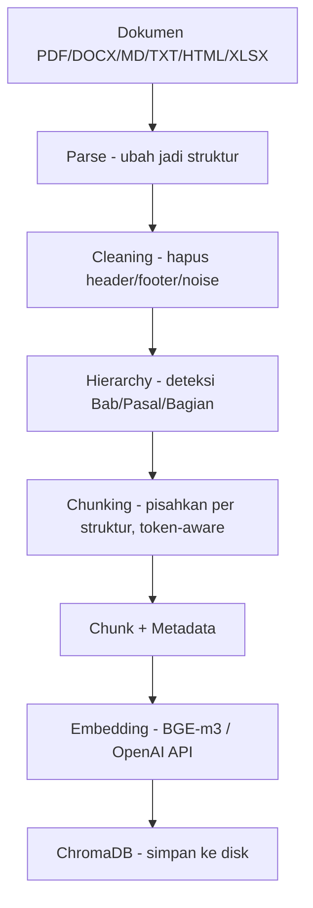
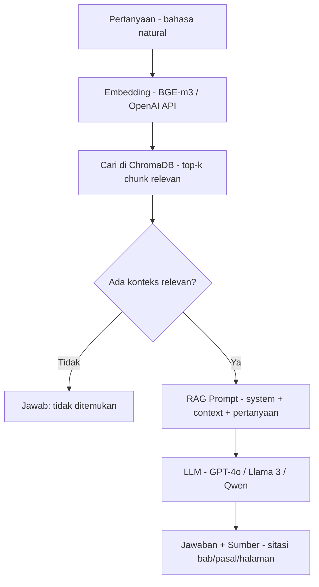
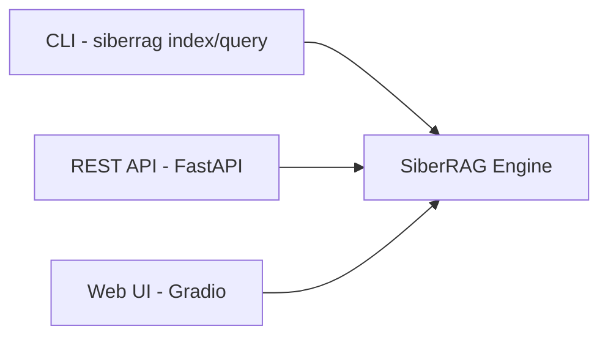

# 🇮🇩 SiberRAG

> **RAG Engine yang dirancang khusus untuk dokumen & Bahasa Indonesia.**

Kebanyakan tools RAG (LangChain, LlamaIndex, dll) dioptimalkan untuk dokumen berbahasa Inggris dengan struktur sederhana. Saat dipakai untuk **dokumen Indonesia** — regulasi, novel, jurnal, laporan, manual, karya tulis — hasilnya sering berantakan: chunking memotong di tengah bab/pasal, heading hilang, dan retrieval tidak mengerti bahasa campuran formal/kasual yang khas Indonesia.

SiberRAG menyelesaikan ini dari akar: **chunking yang menghormati struktur dokumen Indonesia + retrieval yang memahami bahasa natural.**

---

## ❓ Kenapa SiberRAG? (Bukan LangChain/LlamaIndex biasa)

| Masalah dengan RAG generik | Solusi SiberRAG |
|---|---|
| ⚠️ Chunking memotong di tengah Bab/Pasal/Bagian, konteks rusak | ✅ **Heading boundary keras** — Bab/Pasal/Bagian/Bab/Lampiran selalu jadi pemisah chunk |
| ⚠️ "BAB XV"/"Bagian Kedua" tidak terdeteksi sebagai heading (PDF Indonesia) | ✅ **Pattern detection struktur** — deteksi heading berbasis pola teks, bukan cuma font-size |
| ⚠️ Retrieval tidak ngerti pertanyaan kasual Indonesia | ✅ **BGE-m3 multilingual** + teruji 7/7 untuk pertanyaan manusia awam (bahasa sehari-hari) |
| ⚠️ Header/footer berulang (nomor halaman, running header) mencemari chunk | ✅ **Smart cleaning** — hapus noise tanpa rusak struktur |
| ⚠️ Konten lintas-bab/topik bercampur dalam satu chunk | ✅ **Hierarki terjaga** — konten lintas-bab dipisah, tidak campur topik |
| ⚠️ Dokumen PDF Indonesia sering encoding-nya rusak / layout aneh | ✅ **Parser dengan fallback** — Docling primary + native (PyMuPDF/docx), + force-split untuk teks aneh |
| ⚠️ API key bocor ke git / susah konfigurasi | ✅ **Auto-load `.env`** — API key aman, tidak perlu export manual |
| ⚠️ Terlalu kompleks, butuh banyak boilerplate | ✅ **Single command** — `siberrag index` + `siberrag query`, selesai |

### Dibuktikan dengan data

Diuji pada berbagai jenis dokumen Indonesia:

- ✅ **UUD 1945** — setiap Pasal/BAB jadi chunk terpisah, tidak campur topik
- ✅ **Novel berbahasa Indonesia** — retrieval menemukan tokoh & setting dengan akurat
- ✅ **Jurnal akademik** — header/footer berulang terhapus, section terstruktur
- ✅ Retrieval akurat **7/7** untuk pertanyaan ala manusia awam tanpa keyword:
  - "gimana sih sebenarnya negara kita berdiri di atas apa?" → ditemukan ✅
  - "temen aku orang bule pengen jadi warga sini" → kewarganegaraan ✅
  - "aku suka ngomong kalau liat salah pemerintah, takut dijerat" → kebebasan berekspresi ✅
- ✅ Jawaban LLM disertai **sitasi sumber** (bab/pasal/halaman/skor)

---

## ✨ Fitur

### 📄 Document Preprocessing (v1)
- **Multi-format**: PDF, DOCX, XLSX, HTML, Markdown, TXT
- **Parser**: Docling (primary) + native fallback (PyMuPDF, python-docx, openpyxl, bs4)
- **Smart cleaning**: hapus noise (header/footer berulang, page number, OCR rusak) tanpa merusak struktur
- **Heading detection struktur**: Bab/Pasal/Bagian/Lampiran/bab markdown (pola teks + font-size)
- **Token-aware chunking**: target 450–550 token, tidak potong struktur
- **Quality score**: validator menilai setiap chunk (0–100)

### 🧠 RAG Penuh (v2)
- **Embedding hybrid**: local BGE-m3 (gratis/offline) atau API custom (DeepInfra/OpenAI/Jina/Ollama)
- **Vector DB**: ChromaDB (embedded, simpan ke disk)
- **Retrieval semantik**: memahami Bahasa Indonesia natural, bukan keyword match
- **LLM generation**: local Hugging Face Transformers atau API custom OpenAI-compatible
- **REST API**: FastAPI (index/query/stats)
- **Web UI**: Gradio chat dengan source citations
- **Auto-load `.env`**: API key aman

---

## 🚀 Quick Start

### 1. Install

```bash
git clone <repo> && cd siberrag
python3.11 -m venv .venv && source .venv/bin/activate
pip install -e ".[rag,rag-openai,api,ui]"
```

### 2. Set API key

```bash
cp .env.example .env
# Edit .env: OPENAI_API_KEY=key-deepinfra-anda
```

### 3. Set provider di `config/config.yaml`

```yaml
embedding:
  provider: "local"
  model: "BAAI/bge-m3"
  dim: 1024

llm:
  provider: "local"
  model: "Qwen/Qwen2.5-0.5B-Instruct"
```

### 4. Index & tanya jawab

```bash
# Index dokumen (sekali per dokumen)
siberrag index uu.pdf

# Tanya jawab
siberrag query "Apa kewajiban penyelenggara sistem elektronik?"
```

### 5. (Opsional) Web UI

```bash
python -m siberrag_ui.app
# Buka http://127.0.0.1:7860
```

📖 **[Panduan pemakaian lengkap → docs/USAGE.md](docs/USAGE.md)**

---

## 🏗️ Arsitektur

SiberRAG punya 2 alur utama yang dibangun di atas engine chunking yang sama.

### Alur 1 — Indexing (dokumen → vector DB)



### Alur 2 — Query (pertanyaan → jawaban)



### Akses pengguna



Engine chunking v1 **tidak diubah** — IndexPipeline memanggilnya untuk dapat chunk, lalu embed + store.

---

## 🧪 Kualitas & Testing

```bash
pip install -e ".[dev]"
pytest                              # 103 tests passing
```

Mencakup: chunking, cleaning, hierarchy, embeddings, vectorstore, retrieval, generation, pipeline end-to-end (dengan mock embedder/LLM — cepat & offline).

---

## 📦 Tech Stack

| Lapisan | Teknologi |
|---|---|
| CLI | Typer, Rich |
| Config | Pydantic, PyYAML, python-dotenv |
| Parsing | Docling, PyMuPDF, python-docx, openpyxl, BeautifulSoup4 |
| Chunking | tiktoken (token-aware) |
| Embedding | sentence-transformers (BGE-m3) / OpenAI-compatible API |
| Vector DB | ChromaDB |
| LLM | OpenAI-compatible (GPT-4o, Llama 3, Qwen, dll) |
| API | FastAPI, Uvicorn |
| UI | Gradio |
| Testing | pytest (103 tests) |

Python 3.11+

---

## 📄 Lisensi

MIT

---

## 👨‍💻 Developer

**DataSiberLab**

- 📧 Email: [candrapwr@datasiber.com](mailto:candrapwr@datasiber.com)

---

**SiberRAG** — RAG yang mengerti Bahasa Indonesia & struktur dokumen. Dibangun dari pengalaman nyata, bukan teori.
